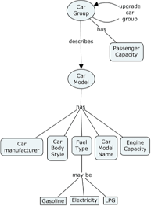
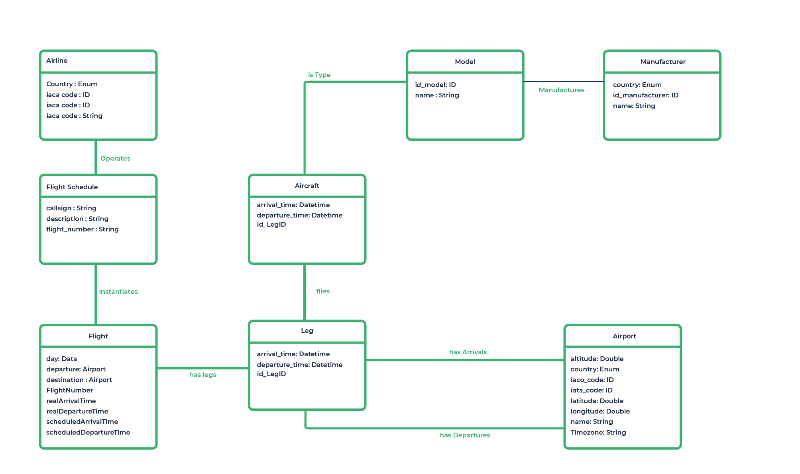
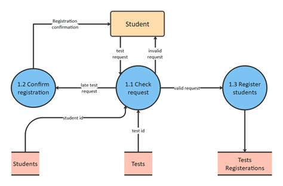

# SI-OLA1

# Technology Stack

### Version Control Platform:

- Git - Github

### Text Editing and Development Environment:

- VSCode / Neovim
- DBeaver
- Postman

### General Online Research Tools:

- Stack Overflow
- MDN Web Docs
- Golang Docs

# Development Stack

### Backend Development:

- Golang (Fiber Framework)

### Frontend Development:

- TypeScript (React Framework)

### Database Management:

- PostgreSQL

### Development Tools:

- Docker
- Docker Compose

### CI/CD Pipeline:

- GitHub Actions

---

# Enterprise Integration

### What is Enterprise Integration?

Enterprise Integration ensures that various systems, applications, and services within an enterprise can communicate and share data effectively. The goal is to ensure that these systems, whether monolithic or microservices, work together as a cohesive unit.

### Diagramming Standards:

Enterprise diagramming standards are guidelines that enterprises use to create consistent diagrams, accurately representing business structure regardless of the creator.

### Business Concept Diagram:

A BCD in enterprise integration illustrates the key concepts, services, and systems involved in the integration process and how they interact at a high level. It visualizes essential components like services, data sources, APIs, and business processes, helping to communicate integration strategies and identify key integration points.



### Entity-Relationship Diagram:

An ERD shows how data entities (e.g., customers, orders, products) relate across systems, providing a detailed view of data flows and databases across integrated systems.



### Application Architecture Diagrams:

Application Architecture Diagrams visually represent the structure and interactions within an application or system. Examples include application environment models, data flow diagrams, and application deployment models.



_application data flow diagram_

---

# System Integration Strategies

### Data-Centric:

#### Definition:

A single source of truth for data is central to the architecture, ensuring better consistency, integrity, and availability.

#### Common Patterns:

- **ETL (Extract, Transform, Load):** Moves and verifies data from various sources into a centralized repository, commonly used in architectures like Data Lakes or Data Warehouses.
- **File Transfer:** Securely transfers large datasets in batch mode between different systems, often seen in data integration pipelines within centralized data stores.
- **Shared Database:** Combines data into one database accessible by multiple applications.
- **Data Replication:** Synchronizes data across multiple systems by maintaining identical copies, supporting distributed architectures while ensuring data consistency.
- **Aggregation:** Collects data from different sources for reporting and analytics, commonly used in Data Warehouses or Data Lakes.

#### Working Example:

An e-commerce application with a centralized database in a monolithic system, where all services—such as user authentication, product catalog, shopping cart, and payment processing—query the same database.

### Event-Driven Integration:

#### Definition:

Event-driven integration enables systems to communicate and integrate through events, fostering real-time responsiveness and agility by allowing loosely coupled components to interact independently.

#### Common Patterns:

- **Message-Driven Communication:** Exchanging messages between components representing commands, requests, or responses.
- **Event-Driven Communication:** Broadcasting events that signal a change in state, allowing other systems to react independently.

#### Working Example:

A payment system sends an "Order Completed" event, which triggers the inventory system to update stock and the shipping system to process delivery. This allows systems to react to events asynchronously.

### Application-Centric Integration:

#### Description:

An application-centric architecture focuses on application functionality, prioritizing business processes, modularity, and integration with other systems.

#### Common Patterns:

- **Facade:** Simplifies complex systems by providing a unified interface.
- **Adapter:** Converts data between incompatible systems.
- **Content-based Routing:** Routes requests based on their content for efficient processing.

#### Working Example:

A CRM system uses a facade to provide a simple interface for external tools, adapters to integrate with legacy systems, and content-based routing to direct customer inquiries to the appropriate support service.

---

# Monolithic vs. Microservices

### Microservice:

- Small
- Focused on one task
- Aligned with a bounded context
- Autonomous
- Independently deployable
- Loosely coupled

**Note:** Microservices should not share a database.

### Summary: Monolithic vs. Microservices for Strategies

| Strategy                | Monolithic                                                      | Microservices                                                              |
| ----------------------- | --------------------------------------------------------------- | -------------------------------------------------------------------------- |
| **Data-Centric**        | Centralized database shared by all components, tightly coupled. | Each service owns its own database, data consistency via events.           |
| **Event-Driven**        | Components communicate via internal events, tightly coupled.    | Services are decoupled and communicate via events through message brokers. |
| **Application-Centric** | Business logic tightly integrated in one system.                | Each service is a self-contained "application," evolving independently.    |

---

# Example of an Integration Pattern: Pipes and Filters

The Pipes and Filters integration pattern structures applications to process data in stages. Each filter represents a processing step, while pipes are conduits for data flow between filters.


_Code example:_

```go
package main

import (
    "fmt"
    "strings"
)

// Define a type for the filters
type Filter func(string) string

// Pipe function that applies filters to the input
func pipe(input string, filters ...Filter) string {
    output := input
    for _, filter := range filters {
        output = filter(output)
    }
    return output
}

// Sample filters
func toUpperCase(input string) string {
    return strings.ToUpper(input)
}

func addExclamation(input string) string {
    return input + "!"
}

func main() {
    // Input to be processed
    input := "hello world"

    // Apply filters using the pipe function
    result := pipe(input, toUpperCase, addExclamation)

    fmt.Println(result) // Output: HELLO WORLD!
}
```
